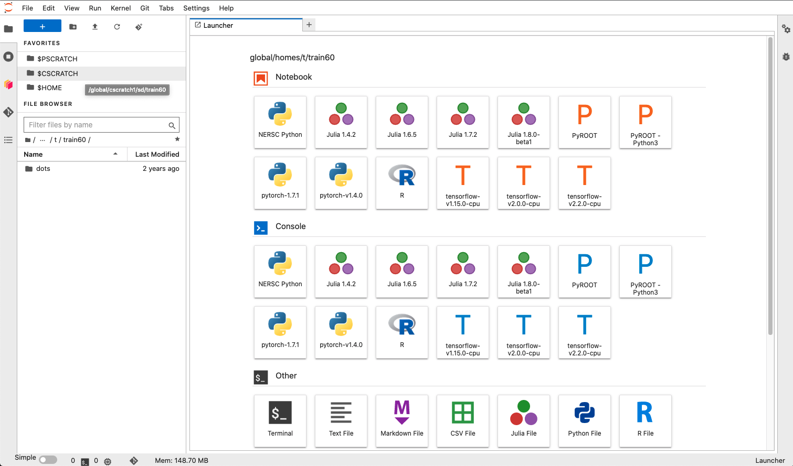
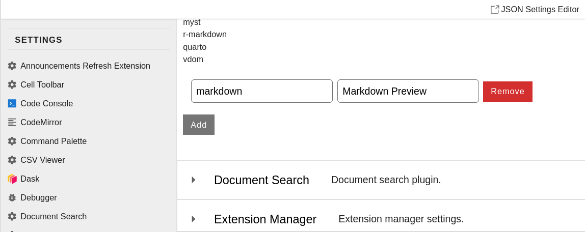

# Accessing and setting up Jupyter Lab environment on Cori

## Access Cori with Jupyter Lab

To access Cori, sign into [https://jupyter.nersc.gov](https://jupyter.nersc.gov) on any browser with your training account username and password.
Once logged in, you should see JupyterHub in the top left corner with options to start kernels on Perlmutter or Cori on CPUs and GPUs. 


Please start a kernel on the Cori shared CPU nodes by clicking on the button. 

Now you should see a user interface with a file navigator on the left and new file selection screen on the right.




See [these slides from a previous NERSC workshop](https://drive.google.com/file/d/1JXbzoP3OQH7qMJ5n4pxwYLgpzC0ittH9/view) for more detailed instructions to familiarize yourself with the Jupyter environment,

## Optional: adjust settings to open Markdown in preview

Let's adjust settings to view documentation more easily. 
Click Settings -> Advanced Settings and select Document Manager.


Scroll down to the bottom of that section, click Add,
and set markdown files to be viewed with Markdown Preview:



## Prepare your environment

Click on $HOME in the upper left corner, which will bring your file browser in the lower left corner to your home directory.

Select `View -> Show Hidden Files` on the menu, which will reveal a number of new files starting with `.` in teh file browser.

Open `.bashrc.ext` by double-clicking on it from the file browser.
Copy the following lines to it (under where it says `User additions to .bashrc go in this file`):

    module load /global/project/projectdirs/m4025/BEAST_TUTORIAL-22/beast-tutorial
    alias ls="ls --color"
    alias sq="squeue -u $USER"
    export PS1="\[\033[01;32m\]\u@\h\[\033[00m\](\[\033[01;31m\]\t\[\033[00m\]):\[\033[01;34m\]\w\[\033[00m\]\$ "

and then save (`Ctrl+S`) and close this file.
This will make sure that every terminal you open will load a module that puts all the required codes in your PATH.
It will also make the output of `ls` colorful, define `sq` to view only the jobs you launched within `squeue`,
and change your terminal prompt to be more colorful and informative.

You can now unselect `View -> Show Hidden Files` on the menu, so as to reduce clutter in the file browser.


## Copy the tutorials

Click on $CSCRATCH in the upper left corner. This is a hyperlink to your scratch directory. This is the directory where you should copy tutorials to and run them.

Next, look at the Launcher window to right and click on "Terminal" (under the "Other" header) to open a new terminal in your scratch directory. If you ever forget the path to this directory you can hover your cursor over the $CSCRATCH hyperlink in the top right to get it.

Within the terminal, run the following commands to **copy the tutorials** into your scratch:

```bash
cd $CSCRATCH
cp -a /global/project/projectdirs/m4025/BEAST_TUTORIAL-22/Calculations-clean/ .
```

Also click $CSCRATCH on the top left again if your file browser is not in the same path.

You should see `Calculations-clean` within your file browser now.
Double click on it to view the tutorial files (including these instructions in `SETUP.md`).

Open the top-level README.md file by double-clicking on it. It should open in Markdown Preview with the settings change above,
(If you did not change the settings, it will open in edit mode by default, and you can right-click the Markdown file and select "Show Markdown Preview".)

Any .ipynb files (Jupyter notebook files [essentially Python scripts]) can be opened in a new tab by double-clicking on them in your file tree to the left. Each code block can be run by clicking inside the code block and typing "Shift + Enter".

**Important**: remember to work only within the copy of the tutorials within your $CSCRATCH directory made above.
Trying to work directly in the source directory will lead to permissions errors!
